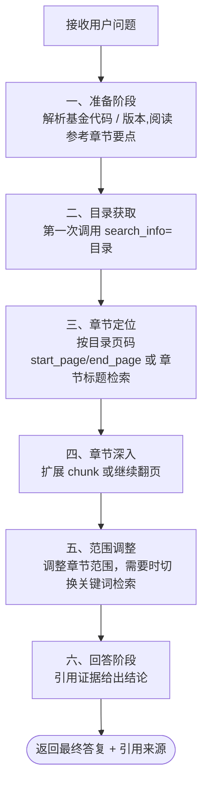
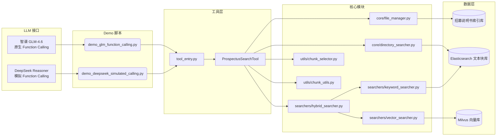
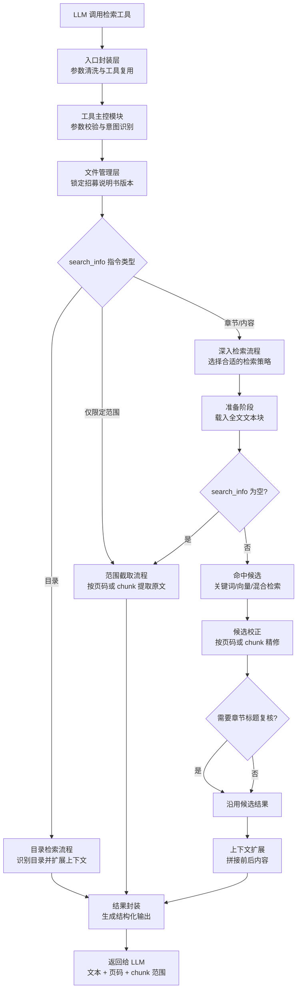

# 招募说明书智能检索项目——基于人类式检索流程

> 对传统rag的改造，让大模型像专业研究员一样读懂厚重的基础设施公募Reits招募说明书，精准定位证据并复核答案。

## 背景与问题

传统 RAG（Retrieval-Augmented Generation）在处理《招募说明书》这类结构化长文档时存在多项痛点：

| 痛点 | 传统 RAG 表现 | 本项目的改造 |
| --- | --- | --- |
| 跨段整合 | 依赖单轮向量检索，难以跨 chunk 汇总 | 强制多轮检索与 chunk 连续扩展，直到覆盖完整章节 |
| 章节定位 | 模型仅凭问题关键词猜测位置，容易偏离 | 必须先取“目录”，再按页码或标题逐步定位章节 |
| 模糊问题 | 查询词不明确时检索效果迅速下降 | 参照人类查阅流程，允许多轮缩放范围、切换策略 |
| 证据引用 | 容易遗漏原文上下文或凭空发挥 | 结果内含完整原文片段、页码 & chunk 范围，回答需引用来源 |

借助这一流程，工具非常适合章节繁多、篇幅巨大的基础设施公募 REITs 招募说明书等金融公告场景。

## 人类式检索流程详解

本项目规定特定的检索流程，指导llm像人类一样阅读招募说明书，llm可多轮调用同一个检索工具(ProspectusSearchTool)，逐步探索找出答案：



#### 第一阶段：准备阶段
1. **文档结构学习**：读取17个章节的结构化参考问答，理解招募说明书的标准格式
2. **问题解析**：识别基金代码、确定招募说明书版本（首发/扩募）
   
#### 第二阶段：获取目录
3. **目录获取**：首轮必须调用工具获取目标基金的完整目录信息

#### 第三阶段：定位具体章节
1. **章节推断**：结合目录和参考章节要点，推断问题所属的目标章节
2. **章节定位**：采用两种策略定位目标章节正文：
   - 基于页码范围的直接定位
   - 基于章节标题的检索定位

#### 第四阶段：章节深入检索
6. **渐进式扩展**：若首轮检索未覆盖目标章节完整信息，按页码或chunk_id连续扩展文本块

#### 第五阶段：调整检索范围
7. **策略切换**：若目标章节无答案，智能切换到其他可能章节或使用关键词检索

#### 第六阶段：汇总回答
8. **证据整合**：汇总所有检索结果，引用原文证据，标注信息来源


## 系统架构



## 检索工具（ProspectusSearchTool）详解

### 1. 工具执行流程

#### 流程图


#### 2. 关键节点拆解

(1) **入口封装层**：首先对模型传入的参数做统一化处理（如去除多余空格、解析布尔/数字选项），并复用已经初始化好的工具实例，以节省数据库和服务连接的消耗。
(2) **招募说明书定位**：根据基金代码和是否扩募的标记，访问招募说明书索引库，找到实际需要检索的招募说明书文件，确保后续操作围绕正确文档展开。
（3） **目录检索分支**：当指令要求“目录”时，系统会在 Elasticsearch 中提取包含目录关键词的多个文本块，再通过 LLM 判别真正的目录位置，并拼接相邻内容，一次性返回较完整的目录段落。
（4） **范围直取分支**：当调用方只给出页码或 chunk 范围且不提供检索词时，系统直接在全集文本块中截取对应范围，方便进行“翻页式”阅读或按页核对。
（5） **章节/内容检索分支**：
   - 先根据 `search_info` 判断是章节标题查找还是内容关键词查找，并映射到关键词检索、向量检索或两者融合的模式；
   - 载入整份招募说明书的文本块，便于后续做范围裁剪与上下文扩展；
   - 对非空查询执行检索，根据传入参数`start_page` / `end_page` / `start_chunk_id` / `end_chunk_id` 限制在指定页码或 chunk 区间；
   - 若是章节标题任务，会让 LLM 在候选中甄别真正的章节开头，避免误把目录引用或脚注当正文。

（6） **上下文扩展与结果封装**：对最终命中的文本块按传入参数`expand_before` / `expand_after`向前向后拓展，合并成连贯语段，同时计算对应的页码和 chunk 范围，输出统一的结构化结果，供 LLM 在回答时引用并标注来源。

### 3. 工具参数与检索策略

| 字段 | 说明 | 典型用途 |
| --- | --- | --- |
| `fund_code` | 基金代码（必填） | 识别招募说明书文件 |
| `search_info` | 检索指令（必填） | 支持：`"目录"`、`"章节标题检索：第十四部分 基础设施项目基本情况"`、`"内容检索：基金管理费"`、`""`（配合范围参数直接取原文） |
| `is_expansion` | 是否扩募版 | True 时查找扩募招募说明书 |
| `start_page` / `end_page` | 页码范围限制 | 根据页码精准截取章节 |
| `start_chunk_id` / `end_chunk_id` | chunk_id 范围限制 | 根据chunk_id精准截取章节 |
| `expand_before` / `expand_after` | 上下文扩展 | 将命中 chunk 前后若干段一起返回 |

组合策略示例：
- **获取完整目录**：`search_info="目录"`，获取章节结构与页码；
- **页码范围文本提取**：返回的页码范围内的文本信息 `start_page/end_page`，`search_info=""` 直接抓取正文；
- **chunk_id范围文本提取**：返回的chunk_id范围内的文本信息 `start_page/end_page`，`search_info=""` 直接抓取正文；
- 
- **标题检索**：`search_info="章节标题检索：第十四部分 基础设施项目基本情况"`，`expand_after=x` 预览开头文本；
- **关键词检索**：`search_info="内容检索：xxx"`，必要时限制 `start_chunk_id/end_chunk_id` 或 `start_page/end_page` 在目标章节范围内。

## 不同推理模型接入方案

考虑到检索流程的复杂性和对遵从提示词的要求，建议使用推理模型，项目选取了两个推理llm进行演示，分别是智谱 GLM-4.6和DeepSeek Reasoner：

### 1. 智谱 GLM-4.6 —— 原生 Function Calling
- `demo_glm_function_calling.py` 使用 OpenAI 兼容接口直连智谱 GLM-4.6 模型。
- 智谱 GLM-4.6 具备较强的Function Calling能力，基本可按照提示词流程要求完成任务，并会根据实际情况灵活调整，检索效率和准确率很高。

### 2. DeepSeek Reasoner —— 模拟 Function Calling
- DeepSeek Reasoner 具备强大的推理能力，在复杂流程任务中表现更好。但是该模型不具备Function Calling能力，为了解决这一问题`demo_deepseek_simulated_calling.py` 中引导DeepSeek Reasoner“模拟”调用工具，自定义输出格式：
  - 模型每轮必须输出 `TOOL_CALL:` 或 `FINAL_ANSWER:`；
  - 系统解析 JSON 并校验必填参数；
  - 工具执行结果包装为追加用户消息，驱动下一轮推理。
- 该模式充分发挥 DeepSeek Reasoner 的链式推理能力，实际表现更贴合预期流程且答案准确率更高。

## 配套数据

- `招募说明书_qa.json`：招募说明书章节要点参考，将注入llm系统提示，帮助llm理解常见章节结构；可按需扩充问答条目以覆盖自定义文档格式。
- 本项目的检索数据为全部公募reits招募说明书文本信息，在项目建立前已将招募说明书文本信息清洗并切分成文本块（每个文本块字符数量在200-1000之间），并保存至Elasticsearch、转为向量保存至向量数据库。招募说明书整个清洗及入库流程见 [RAG-REITsTextFlow](https://github.com/adennng/RAG-REITsTextFlow)，该流程可自动处理跨页表格、提取全部文字、表格信息，适用于公告类 PDF 文件。（获取或调用数据可联系作者）

## 目录结构与文件说明

```text

├── intelligent_search
│   ├── core/                    # 文件与目录检索核心模块
│   ├── searchers/               # 关键词 / 向量 / 混合检索实现
│   ├── utils/                   # 页码、chunk 处理与 LLM 辅助函数
│   ├── tool_entry.py            # LLM 工具封装与参数校验
│   ├── prospectus_search_tool.py# 核心检索编排
│   ├── db_config.py  # 数据库连接配置
│   └── model_config.py          # tool内部使用的模型配置
├── model_config.py            # 推理llm的模型配置
├── demo_glm_function_calling.py # 原生 function calling 模式脚本
├── demo_deepseek_simulated_calling.py # DeepSeek Reasoner 模拟调用模式脚本
├── 招募说明书_qa.json           # 章节参考问答
├── log/                         # 两个模式演示运行日志
└── output/                      # DeepSeek Reasoner 模式下会将每轮思考、指令、工具响应打包写入 output/{run_id}.json
```

| 路径 | 说明 |
| --- | --- |
| `intelligent_search/core/file_manager.py` | 连接招募说明书索引库，定位首发/扩募版文件名 |
| `intelligent_search/core/directory_searcher.py` | 使用 ES + LLM 精确抽取目录并扩展上下文 |
| `intelligent_search/searchers/keyword_searcher.py` | 基于 Elasticsearch 的关键词检索，支持范围过滤 |
| `intelligent_search/searchers/vector_searcher.py` | 基于 Milvus + 智谱 embedding 的语义检索 |
| `intelligent_search/searchers/hybrid_searcher.py` | 合并关键词与语义检索结果，去重并标注来源 |
| `intelligent_search/utils/chunk_selector.py` | 由 LLM 从候选中甄别真正的章节标题正文 |
| `intelligent_search/utils/chunk_utils.py` | 执行范围过滤、上下文扩展、文本合并等操作 |
| `intelligent_search/tool_entry.py` | 对外暴露 `prospectus_search` 工具，提供参数解析与单例缓存 |
| `demo_glm_function_calling.py` | 展示原生 function calling 的完整对话驱动、日志记录与思维链解析 |
| `demo_deepseek_simulated_calling.py` | 展示模拟工具调用协议、输出解析、会话持久化逻辑 |

---

联系方式：412447958@qq.com
